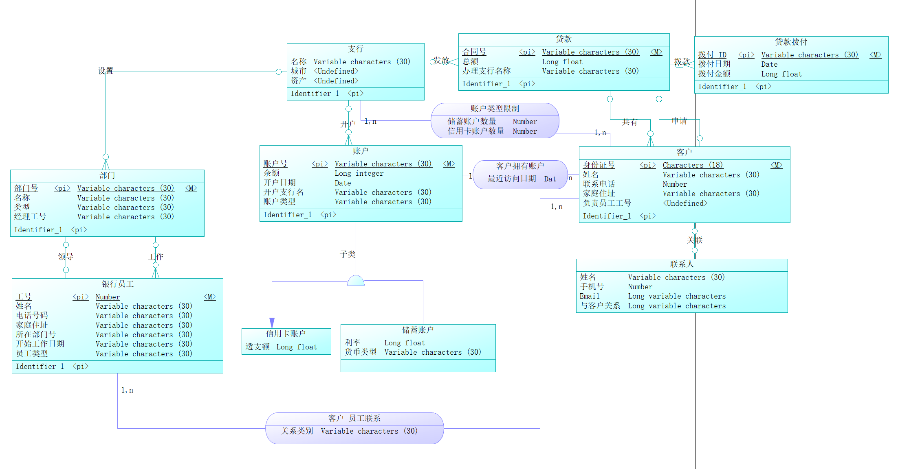
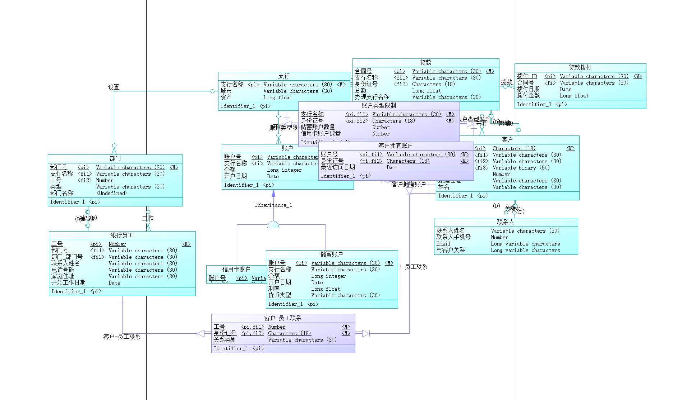
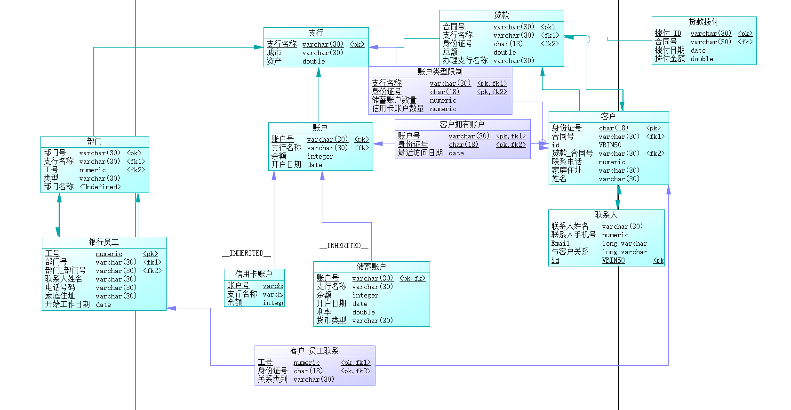

# 银行业务管理系统数据库设计

PB22111620 Ai Chang

## 1 概念模型设计

### 1.1 实体设计

- 支行: <u>名称</u>, 城市, 资产
- 账户: <u>账户号</u>, 余额, 开户日期, 开户支行名, 账户类型
    - 储蓄账户: 利率, 货币类型
    - 信用卡账户: 透支额
- 客户: <u>客户身份证号</u>, 姓名, 联系电话, 家庭住址
- 联系人: <u>id</u>, 姓名, 手机号, email, 与客户关系
- 部门: <u>部门号</u>, 名称, 类型, 经理工号
- 员工: <u>工号</u>, 姓名, 电话, 家庭住址, 开始工作日期, 员工类型, 所在部门号
- 贷款: <u>合同号</u>, 办理时的支行名称, 总额
- 贷款拨付: <u>拨付id</u>, 拨付日期, 拨付金额

### 1.2 联系 (association) 设计

- 拥有(客户-账户): 账户-拥有为 1 对 n, 因为一个账户可以为多个客户所共有; 客户-拥有也为
1 对 n, 因为一个客户可以有多个账户. 具有属性最近访问日期, 每组客户-账户都要单独记录, 
所以该属性需要放在联系中
- 账户类型限制(支行-客户): 支行-账户类型限制为 1 对 n, 一个支行内会有多个客户; 
客户-账户类型限制为 1 对 1, 因为每个客户在每个支行最多开一个储蓄账户和一个信用卡账户
- 客户-员工联系: 客户可能和某个银行员工发生联系, 该员工是此客户的贷款负责人或银行账户负责人,
- 一个员工可以担任多个客户的负责人

### 1.3 关系 (relationship) 设计

- 设置, 支行-部门, 一对多
- 领导, 员工-部门, 一对一
- 工作, 员工-部门, 一对一
- 发放: 支行-贷款, 一对多
- 开户, 支行-账户, 一对多
- 拨款, 贷款-贷款拨付, 一对多
- 共有, 贷款-客户, 一对多
- 申请, 贷款-客户, 一对一
- 关联, 客户-联系人, 一对一

### Power Designer 的 ER 图



## 2 概念模型到逻辑模型的转换

### 2.1 实体转换

每个实体转换为一个关系模式, 实体的属性为关系模式的属性, 实体的标识成为关系模式的主码

### 2.2 联系转换

- 1:1, 将任一端的标识和联系属性加入另一实体所对应的关系模式中, 两模式的主码保持不变
- 1:N, 将 1 端实体的标识和联系属性加入 N 端实体所对应的关系模式中, 两模式的主码不变
- M:N, 新建一个关系模式, 该模式的属性为两端实体的标识以及联系的属性, 主码为两端关系模式的主码的组合

### 2.3 最终的关系模式



## 3 MySQL 数据库结构实现

### 3.1 Power Designer 的 PDM 图



### 3.2 数据库表定义

```MySQL
/*==============================================================*/
/* Table: 信用卡账户 */
/*==============================================================*/
create table 信用卡账户
(
支行名称 varchar(30) not null comment '',
账户号 varchar(30) not null comment '',
余额 bigint comment '',
开户日期 date comment '',
透支额 bigint comment '',
primary key (支行名称, 账户号)
);
/*==============================================================*/
/* Table: 储蓄账户 */
/*==============================================================*/
create table 储蓄账户
(
支行名称 varchar(30) not null comment '',
账户号 varchar(30) not null comment '',
余额 bigint comment '',
开户日期 date comment '',
利率 double comment '',
货币类型 varchar(30) comment '',
primary key (支行名称, 账户号)
);
/*==============================================================*/
/* Table: 员工 */
/*==============================================================*/
create table 员工
(
支行名称 varchar(30) not null comment '',
部门_部门号 varchar(30) not null comment '',
工号 varchar(30) not null comment '',
部门_支行名称 varchar(30) comment '',
部门号 varchar(30) comment '',
姓名 varchar(30) comment '',
电话 varchar(30) comment '',
家庭住址 varchar(30) comment '',
开始工作时间 date comment '',
primary key (支行名称, 部门_部门号, 工号)
);
/*==============================================================*/
/* Table: 客户 */
/*==============================================================*/
create table 客户
(
贷款_支行名称2 varchar(30) not null comment '',
合同号 varchar(30) not null comment '',
客户id varchar(30) not null comment '',
支行名称 varchar(30) not null comment '',
贷款_支行名称 varchar(30) comment '',
贷款_合同号 varchar(30) comment '',
姓名 varchar(30) comment '',
联系电话 varchar(30) comment '',
家庭住址 varchar(30) comment '',
储蓄账户数量 numeric(8,0) comment '',
信用卡账户数量 numeric(8,0) comment '',
primary key (贷款_支行名称2, 合同号, 客户id)
);
/*==============================================================*/
/* Table: "客户-员工联系" */
/*==============================================================*/
create table "客户-员工联系"
(
贷款_支行名称2 varchar(30) not null comment '',
合同号 varchar(30) not null comment '',
客户id varchar(30) not null comment '',
支行名称 varchar(30) not null comment '',
部门_部门号 varchar(30) not null comment '',
工号 varchar(30) not null comment '',
关系类别 varchar(30) comment '',
primary key (支行名称, 部门_部门号, 贷款_支行名称2, 合同号, 客户id, 工号)
);
/*==============================================================*/
/* Table: 拥有 */
/*==============================================================*/
create table 拥有
(
贷款_支行名称2 varchar(30) not null comment '',
合同号 varchar(30) not null comment '',
客户id varchar(30) not null comment '',
支行名称 varchar(30) not null comment '',
账户号 varchar(30) not null comment '',
最近访问日期 char(10) comment '',
primary key (支行名称, 贷款_支行名称2, 合同号, 客户id, 账户号)
);
/*==============================================================*/
/* Table: 支行 */
/*==============================================================*/
create table 支行
(
支行名称 varchar(30) not null comment '',
城市 varchar(30) comment '',
资产 float(10,0) comment '',
primary key (支行名称)
);
/*==============================================================*/
/* Table: 联系人 */
/*==============================================================*/
create table 联系人
(
贷款_支行名称2 varchar(30) not null comment '',
合同号 varchar(30) not null comment '',
客户id varchar(30) not null comment '',
联系人id VBIN30 not null comment '',
联系人姓名 varchar(30) comment '',
手机号 varchar(30) comment '',
email varchar(30) comment '',
与客户关系 varchar(30) comment '',
primary key (贷款_支行名称2, 合同号, 客户id, 联系人id)
);
/*==============================================================*/
/* Table: 账户 */
/*==============================================================*/
create table 账户
(
支行名称 varchar(30) not null comment '',
账户号 varchar(30) not null comment '',
余额 bigint comment '',
开户日期 date comment '',
primary key (支行名称, 账户号)
);
/*==============================================================*/
/* Table: 贷款 */
/*==============================================================*/
4 总结与体会
加深了对数据库设计的理解，加深了对概念模型、逻辑模型、物理模型的认识。
create table 贷款
(
支行名称 varchar(30) not null comment '',
合同号 varchar(30) not null comment '',
贷款_支行名称2 varchar(30) comment '',
客户_合同号 varchar(30) comment '',
客户id varchar(30) comment '',
办理时的支行名称 varchar(30) comment '',
总额 double comment '',
primary key (支行名称, 合同号)
);
/*==============================================================*/
/* Table: 贷款拨款 */
/*==============================================================*/
create table 贷款拨款
(
支行名称 varchar(30) not null comment '',
合同号 varchar(30) not null comment '',
拨款id varchar(30) not null comment '',
拨款具体日期 date comment '',
金额 double comment '',
primary key (支行名称, 合同号, 拨款id)
);
/*==============================================================*/
/* Table: 部门 */
/*==============================================================*/
create table 部门
(
支行名称 varchar(30) not null comment '',
部门号 varchar(30) not null comment '',
员工_支行名称 varchar(30) comment '',
部门_部门号 varchar(30) comment '',
工号 varchar(30) comment '',
部门名称 varchar(30) comment '',
部门类型 varchar(30) comment '',
primary key (支行名称, 部门号)
);
```

## 4 总结与体会

加深了对数据库设计的理解, 以及对概念模型, 逻辑模型, 物理模型的了解